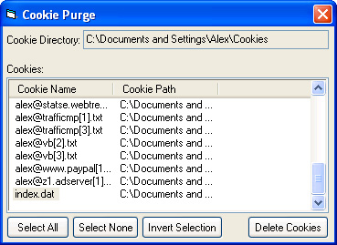



## Cookie Purge

### Description

Retrieves Cookie Directory, enumerates cookies and subsequently purges them from disk.

This project was requested by hkrune, due to its simplicity it would not have been submitted otherwise. OS incompatibility resolved.
 
### More Info
 

             |
---                |---
**Submitted On**   |2003-01-19 14:51:32
**By**             |[Alex Smoljanovic\(aLeX^rS\)](https://github.com/Planet-Source-Code/PSCIndex/blob/master/ByAuthor/alex-smoljanovic-alex-rs.md)
**Level**          |Beginner
**User Rating**    |5.0 (25 globes from 5 users)
**Compatibility**  |VB 5\.0, VB 6\.0
**Category**       |[Internet/ HTML](https://github.com/Planet-Source-Code/PSCIndex/blob/master/ByCategory/internet-html__1-34.md)
**World**          |[Visual Basic](https://github.com/Planet-Source-Code/PSCIndex/blob/master/ByWorld/visual-basic.md)
**Archive File**   |[Cookie\_Pur1531621192003\.zip](https://github.com/Planet-Source-Code/alex-smoljanovic-alex-rs-cookie-purge__1-42523/archive/master.zip)

